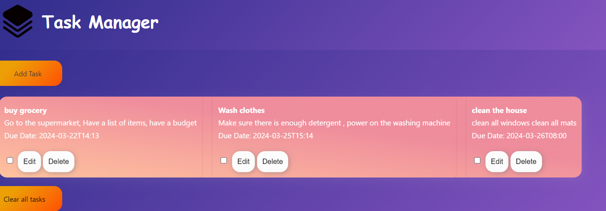

# TASK MANAGER APPLICATION #

## PROJECT OVERVIEW ##
 The Task Manager application is a tool designed to help you keep track of your tasks in a convenient and organized way. It's like having a digital to-do list that you can access anytime, anywhere.

## FEATURES AND FUNCTIONALITY ##
### Add Tasks ### 
You can easily add tasks to your list by filling out a simple form. Just provide a title for your task, a brief description, and the due date. Click the "Add Task" button, and your task will be added to the list.

### Edit Tasks ### 
If you need to make changes to a task, you can do so easily with the edit feature. Click the "Edit" button next to the task you want to modify, make your changes in the form that appears, and then click "Confirm" to save your edits.

### Delete Tasks ### 
Finished with a task or decided you don't need it anymore? No problem! Just click the "Delete" button next to the task, and it will be removed from your list.

### Mark Tasks as Completed ###
 Once you've completed a task, you can mark it as done by checking the checkbox next to it. This helps you keep track of what you've accomplished.

### Clear All Tasks ###
You can clear all tasks from your list at once with the "Clear All Tasks" button. This removes all tasks from the list, giving you a clean slate

## TECHNOLOGIES USED ##
 HTML- forms and front end rendering
 CSS - styling
 JAVASCRIPT - to handle the client-side processing and local storage

## SCREENSHOTS AND DEMO ##

## ROADMAPS AND FUTURE ENHANCEMENTS
 To use MySQL for storage of tasks on the server side.
 To enhance the CSS styling
 To add more features such as writing the progress and including notes if the task is done

## CONTACT INFORMATION ##
 You can reach me on:
     Github: https://github.com/Nyamvula1
     LinkedIn: https://www.linkedin.com/in/khadija-nyamvula
     Twitter: @bejakhadija
     Mobile: 0713266366
